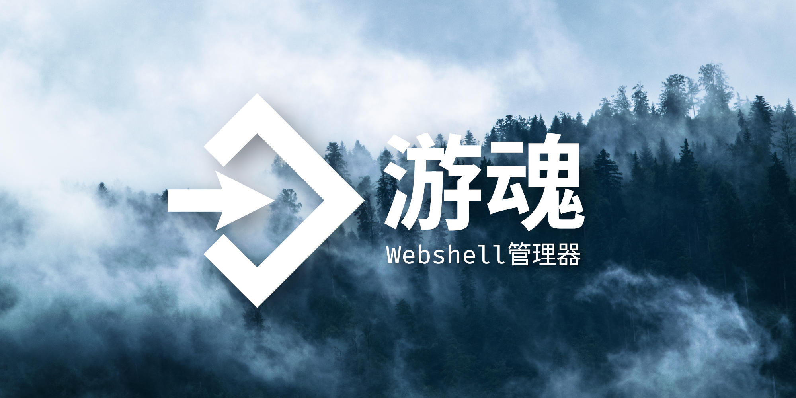
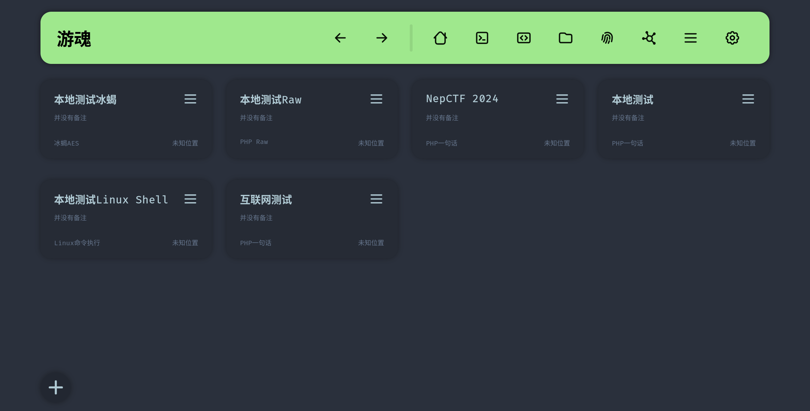
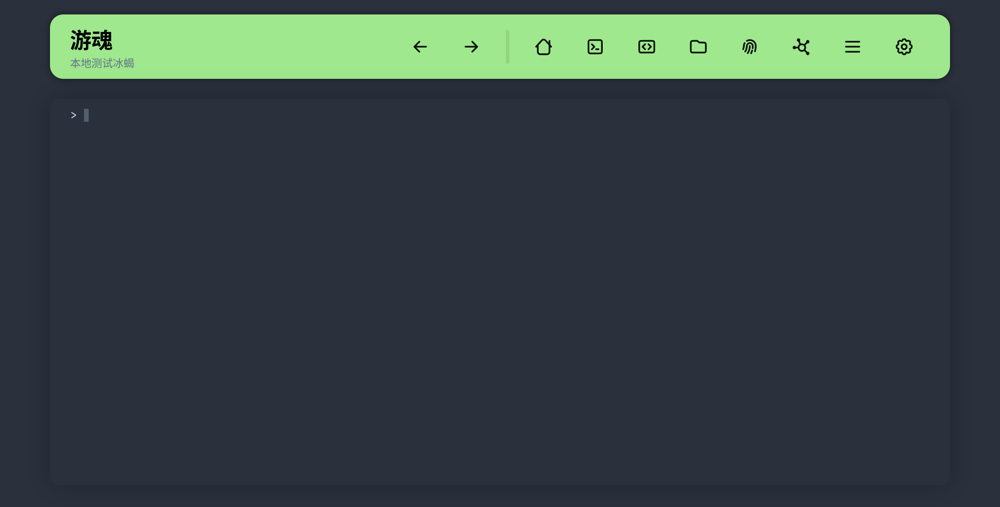
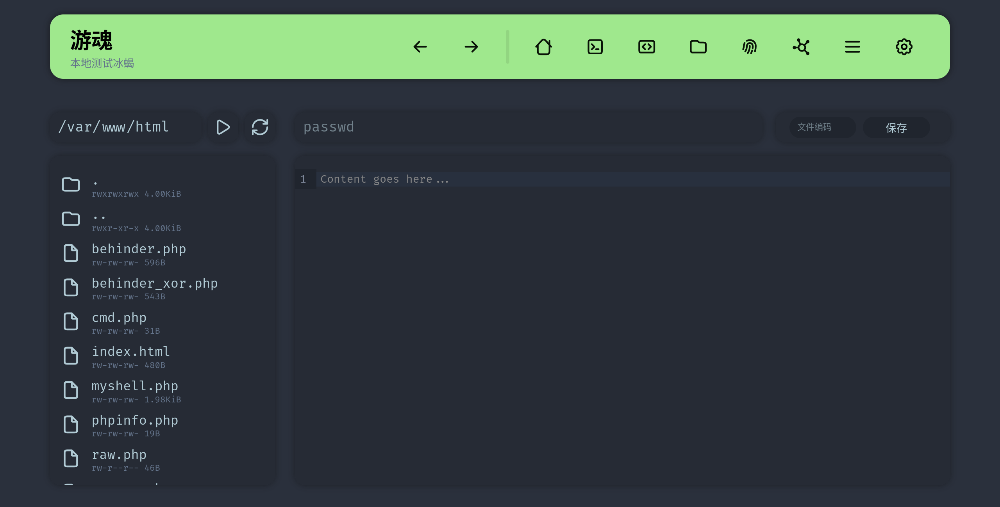

# EtherGhost



<!-- Social preview from https://pixabay.com/photos/fog-forest-conifers-trees-1535201/ -->

[Documentation](./docs.md) | [Download exe](https://github.com/Marven11/EtherGhost/releases) | [Buy Me a Coffee](https://github.com/Marven11/Marven11/blob/main/buy_me_a_coffee.md)

EtherGhost is an open-source Webshell Manager that provides a convenient interface and easy-to-use features. It can complement or replace other webshell managers to help control target machines across various scenarios.

EtherGhost supports common single-line webshells and features from other managers, and can integrate Behinder/AntSword-style webshells so you can use AntSword plugins while benefiting from encrypted traffic.

EtherGhost uses a browser–server architecture, enabling server-side deployment and local browser access to reduce local infection risk.

It includes built-in RSA2048+AES256-CBC encryption; AES keys are generated during connection and transmitted via RSA to prevent replay attacks and traffic analysis.

## Features

- Supports PHP single-line webshells and proxy-style PHP/JSP webshells
- Reverse shell management
- Anti-replay and strong traffic encryption
- TCP forward proxy
- Asynchronous file upload/download
- Chunked Transfer Encoding packet splitting
- AntSword integration
- Random User Agent by default
- HTTP junk padding
- Custom encoders and decoders
- Custom theme and background image

## Previews







## Current Functionality

- Supported webshells
  - PHP single-line
  - Behinder-style PHP
  - Behinder-style JSP (experimental)
  - Linux commands
  - Linux reverse shell
- Webshell operations
  - Command execution
    - Supports pseudo-terminal and general command execution
  - File management
    - Asynchronous file upload/download
  - PHP code execution
  - TCP forward proxy
  - Basic system info
  - Download phpinfo
- Webshell coding
  - HTTP parameter obfuscation
  - AntSword-like encoder/decoder
  - Sessionized payload storage
  - Anti-replay
  - RSA+AES encryption

## Installation

### Windows

Download the exe from [Release](https://github.com/Marven11/EtherGhost/releases).

Or run from source with pip:

```powershell
python -m venv .venv
. .\.venv\Scripts\Activate.ps1
pip install -r requirements.txt
python -m ether_ghost
```

Or use poetry:

```powershell
poetry install
poetry shell
python -m ether_ghost
```

### Linux

Using pip:

```bash
pip install ether-ghost
python -m ether_ghost
```

Using pip + venv:

```bash
cd EtherGhost
python -m venv .venv
. .venv/bin/activate
pip install -r requirements.txt
python -m ether_ghost
```

Using poetry:

```bash
cd EtherGhost
poetry install
poetry shell
python -m ether_ghost
```

## Why Not AntSword?

AntSword is excellent, but its Electron 4 basis and architecture make some desired features impractical, and outdated dependencies add risk. EtherGhost aims to provide those capabilities with a simpler, modern stack.

## Why Not Behinder?

Behinder’s AES CBC implementation uses an all-zero IV, reducing randomness and making detection easier. EtherGhost provides optional strong encryption and session features with additional anti-replay to mitigate analysis.

## Disclaimer

```
Use this tool responsibly and legally. Unauthorized security testing is illegal and may cause harm.

1. Purpose: This tool is for educational and authorized testing only.
2. Legality: Unauthorized access is illegal. Ensure compliance with laws and ethical guidelines.
3. Authorization: Obtain proper authorization before any testing.
4. Indemnification: Use at your own risk; we are not liable for damages arising from use.
5. Educational Use: For lawful security testing, research, and education.
6. Shared Responsibility: Respect others’ privacy and rights at all times.
```
